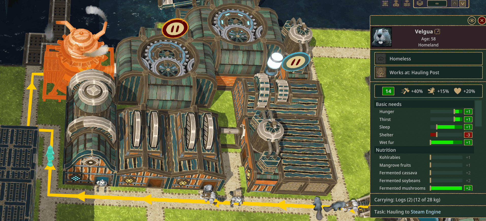

# Beaver Task Display

> See what every beaver, bot, and golem is up to — at a glance.

A [Timberborn](https://store.steampowered.com/app/1062090/Timberborn/) mod that adds a task description row to every entity's info panel, telling you exactly what they're doing and where they're going.



## Why this mod?

The vanilla entity panel tells you a beaver's name, faction, role, and what they're carrying — but it doesn't tell you *what they're doing right now* or *where they're going*. When you click a walking beaver, you're left guessing whether they're heading to work, lunch, bed, or a building site half the map away.

Beaver Task Display fixes that. Click any beaver, bot, or golem and you'll immediately see something like **"Walking to work at Forge"** — and one more click jumps your camera straight to the Forge. Pause and you'll see the beaver's intended path across the map. 

## Features

- Live task labels for **beavers, bots, and golems** (any entity with a `BehaviorManager` and a `Walker`)
- Recognises **walking intent** — hauling, working, eating, drinking, sleeping, visiting attractions, building, planting, harvesting
- Distinguishes **haul pickups** from **haul deliveries** based on what the entity is currently carrying
- Recognises **on-site actions** — Building, Planting, Harvesting, Producing, Eating, Drinking, Sleeping, Bathing, Healing, and more
- **Clickable destination** name focuses the camera on the target building
- **Coloured highlight** marks the destination on the map
- **Path drawing** for beavers on the move. Useful to see what buildings you might want to move closer to each other.
- **No save-game changes** — safe to add or remove from a save at any time

## Examples

| Situation | What the panel shows |
| --- | --- |
| A hauler going to pick up logs | `Hauling from Lumberjack Flag` |
| A hauler delivering logs to storage | `Hauling to Large Warehouse` |
| A beaver walking to their job | `Walking to work at Forge` |
| A beaver hungry and walking to food | `Walking to eat at Tavern` |
| A beaver actively eating | `Eating` |
| A beaver heading to bed | `Walking to sleep at Lodge` |
| A bot heading to a build site | `Walking to build at Path` |
| A planter walking to a planting zone | `Walking to plant` |

## Install — Steam Workshop (recommended)

1. Subscribe at the Steam Workshop page: https://steamcommunity.com/sharedfiles/filedetails/?id=3724431393
2. Launch Timberborn — the Mod Manager will detect and list the mod.
3. Enable it and start (or load) a save.

## Install — Manual (GitHub Releases)

1. Download `BeaverTaskDisplay-v1.0.0.0.zip` from the [Releases page](../../releases).
2. Extract the contents into `Documents/Timberborn/Mods/BeaverTaskDisplay/` (create the folder if it doesn't exist).
3. Confirm the structure looks like this:
   ```
   Documents/Timberborn/Mods/BeaverTaskDisplay/
   ├── manifest.json
   ├── Scripts/
   │   └── grantemsley.BeaverTaskDisplay.dll
   └── Localizations/
       └── enUS_BeaverTaskDisplay.csv
   ```
4. Launch Timberborn — the Mod Manager will list "Beaver Task Display".

## Building from source

For developers who want to modify the mod:

1. Set up a Timberborn modding Unity project per the [official modding wiki](https://github.com/mechanistry/timberborn-modding/wiki) (Unity 6000.0.16f1, the Timberborn modding template).
2. Clone this repository into `Assets/Mods/BeaverTaskDisplay/` inside the modding project.
3. In Unity: **Timberborn → Show Mod Builder → tick "Beaver Task Display" → Build all**.
4. The built mod is deployed to `Documents/Timberborn/Mods/BeaverTaskDisplay/` automatically.

See `CLAUDE.md` for an in-depth architecture write-up, behaviour/executor mapping tables, and notes on the game internals this mod hooks into.

## Compatibility

- **Game version:** Timberborn 1.0.0.0 or later
- **Required mods:** none
- **Other UI mods:** should coexist cleanly. The task row attaches at `AddBottomFragment` order **100**, leaving plenty of room above for other mods.

## Known limitations

- When the walking destination is the beaver's home or workplace, the game's blue "relation" highlight overrides this mod's orange destination highlight. The task text is still correct; only the colour is affected.
- **English only** at launch. Translators welcome — see `Data/Localizations/enUS_BeaverTaskDisplay.csv` for the localisation keys and open a PR with additional language files (e.g. `frFR_BeaverTaskDisplay.csv`).
- Uses reflection on private Timberborn fields. A future game update that renames internals could degrade some specific labels to a generic "Walking to" fallback — the mod will not crash; unknown executors fall through gracefully.

## Contributing

Bug reports, feature suggestions, and translation pull requests are very welcome. Please [open an issue](../../issues) before starting non-trivial work so we can chat about the approach.

## Credits

- **Author:** Grant Emsley ([@grantemsley](https://github.com/grantemsley))
- Thanks to **Mechanistry** for Timberborn and the official modding template.

## License

This mod is licensed under the [GNU General Public License v3.0](LICENSE).

Copyright (C) 2026 Grant Emsley.
